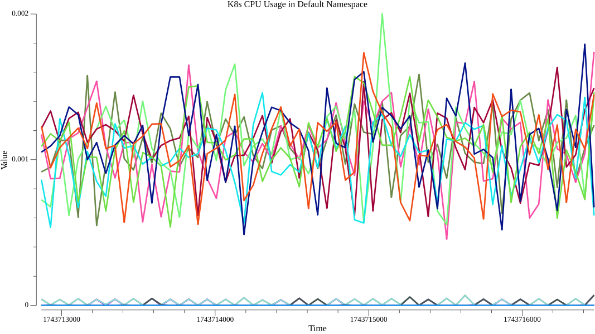

# PromViz

PromViz is a tool for visualizing Prometheus query results as graphs and uploading them to MinIO/S3 storage.

## Example Visualization

Below is an example visualization for the query `rate(container_cpu_usage_seconds_total{namespace="default"}[1m])`:

## Project Redescription: Prometheus Query Visualization Service

**Project Goal:**

The objective of this project is to develop a robust and efficient Golang application that serves as a visualization layer for Prometheus monitoring data. This application will provide a user-friendly web interface allowing users to submit PromQL queries and receive visually appealing representations of the resulting time-series data in the form of PNG images.

**Development Requirements:**

The development team is tasked with building a Golang application that adheres to the following technical specifications:

1.  **Web Interface Implementation:** Develop a web interface capable of receiving PromQL queries and potentially additional request parameters via HTTP requests (both GET and POST methods should be considered).
2.  **Prometheus Integration:** Implement seamless integration with a Prometheus instance accessible at `http://localhost:9090`. The application must be able to forward the received PromQL queries and any associated request body to this Prometheus endpoint.
3.  **Data Processing and Visualization:** Upon receiving a response from the Prometheus instance, the application must process the data and generate an elegant and informative visualization of the time-series data. This visualization should be rendered as a PNG image.
4.  **Image Rendering:** Implement the logic for converting the processed Prometheus response data into a visually appealing PNG image. Consider utilizing appropriate Golang libraries for data visualization and image generation.
5.  **Response Handling:** The application must serve the generated PNG image as the response to the user's web request.

**Key Considerations for the Development Team:**

* **Performance:** The application should be designed for efficient handling of queries and image generation to ensure a responsive user experience.
* **Error Handling:** Implement robust error handling mechanisms to gracefully manage potential issues such as network connectivity problems with the Prometheus instance, invalid PromQL queries, or errors during image generation.
* **Scalability:** While the initial target Prometheus instance is `localhost`, consider designing the application with potential future scalability and configuration in mind.
* **Elegance and Usability:** The generated PNG images should be visually clear, well-labeled, and effectively communicate the insights from the Prometheus data.

This project aims to provide a valuable tool for visualizing Prometheus metrics, enhancing the understanding and analysis of system performance. The development team is expected to leverage their expertise in Golang and related technologies to deliver a high-quality and reliable solution.
